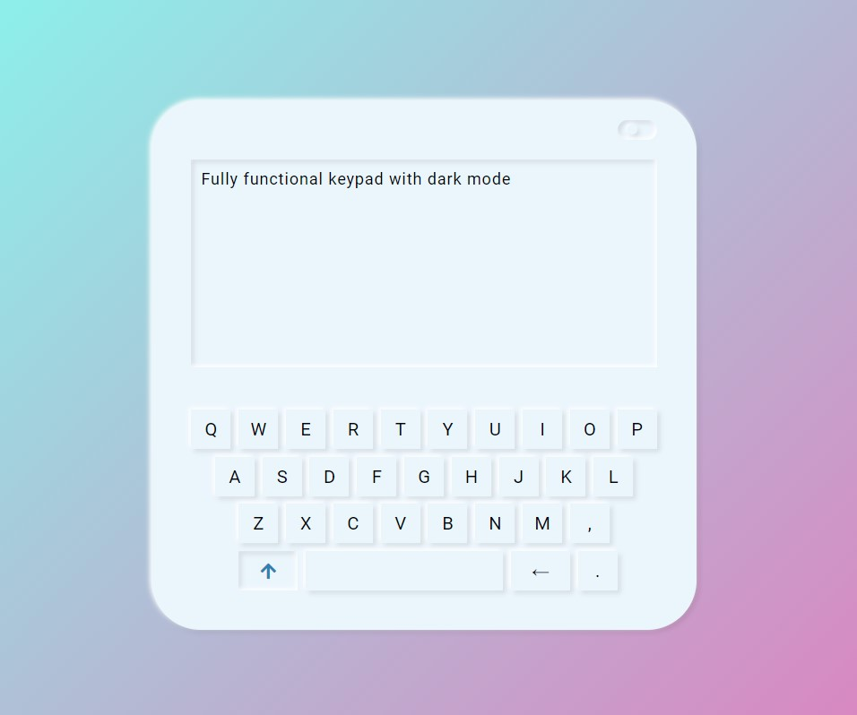
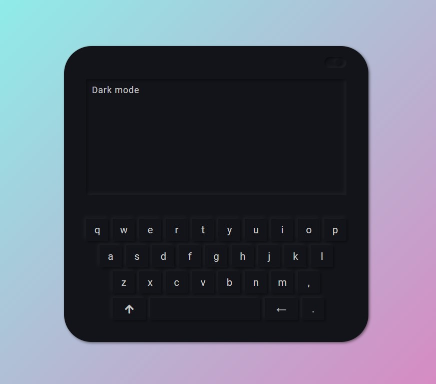

# Keypad App with Dark Mode

Fully Functional Keypad App with Dark Mode

## Table of contents

- [Keypad App with Dark Mode](#keypad-app-with-dark-mode)
  - [Table of contents](#table-of-contents)
  - [Overview](#overview)
    - [The challenge](#the-challenge)
    - [Screenshot](#screenshot)
    - [Links](#links)
  - [My process](#my-process)
    - [Built with](#built-with)

## Overview

### The challenge

Users should be able to:

-   View the optimal layout for the app depending on their device's screen size
-   See hover states for all interactive elements on the page
-   Type with keyboard or by clicking the keypad
-   Use caps and delete keys
-   Change theme to dark mode

### Screenshot

 
 

### Links

-   Solution URL: [Live Website](https://gurhanalan.github.io/JS-Projects-KeyPadApp/)

## My process

### Built with

-   Semantic HTML5 markup
-   CSS custom properties
-   Flexbox
-   Desktop-first workflow
-   Javascript
